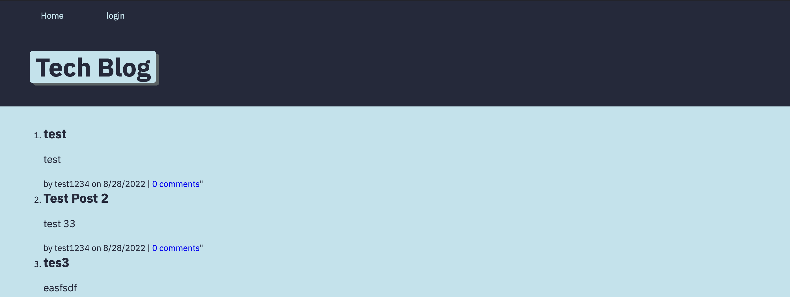

# Tech-blog

  # Table of Contents
1. [Description](#description)
2. [Usage](#usage)
3. [Contribution](#contribution)
4. [Questions](#questions)
5. [Deployed](#deployed)

## Description 
A blog that allows students to login and create posts about things they have learned for their friends and classmates to see 

## Usage 
for anyone who is learning about tech

## Contribution
Spencer 

## Technologies 
* Model View Controller 
* express 
* Sequelize 

## Learned 
I learned about the MVC framework and routes 

## Questions
For any questions please contact me at clarkspencerc@gmail.com or find me on github at clarkspencerc

## Deployed
The site is deployed at [View Site Here](https://clarkspencerc.github.io/tech-blog/)

## Screenshot
